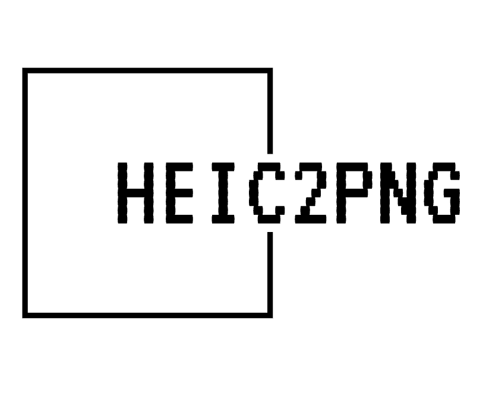

# HeicConverter: Heic 2 PNG

This is a desktop application project that aims to convert heic images to png format because I needed something quick and easy to convert pictures off my phone. **This does not upload your images anywhere else and does the conversion locally on your machine.** In the future we will support other filetypes but this is what I needed most for now!

Built with [wails](https://wails.io/docs/introduction)

Please download via our releases page or feel free to build from source!

### Live Development

To run in live development mode, run `wails dev` in the project directory. This will run a Vite development
server that will provide very fast hot reload of your frontend changes. If you want to develop in a browser
and have access to your Go methods, there is also a dev server that runs on http://localhost:34115. Connect
to this in your browser, and you can call your Go code from devtools.

## Building

To build a redistributable, production mode package, use `wails build`.
